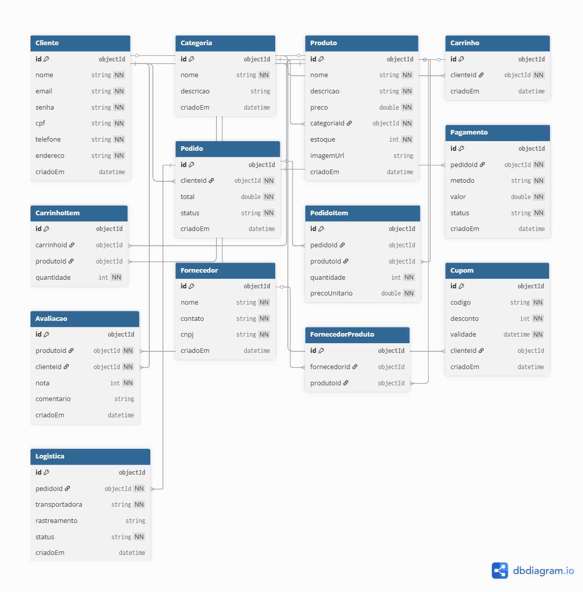

# Ecommerce Backend API

## Tecnologias Utilizadas
- **Node.js**: Ambiente de execução JavaScript para o servidor.
- **Express.js**: Framework para criação de APIs RESTful.
- **MongoDB Atlas**: Banco de dados NoSQL na nuvem para armazenamento de dados.
- **Mongoose**: ODM para modelagem de dados e gerenciamento de relacionamentos.
- **Yup**: Biblioteca para validações de entrada de dados.
- **JWT (jsonwebtoken)**: Para autenticação e autorização de usuários.
- **bcryptjs**: Para hash de senhas.
- **dotenv**: Para gerenciamento de variáveis de ambiente.
- **cors**: Para permitir requisições cross-origin.

## Explicação e Descrição do Sistema
Este projeto é um backend completo para um sistema de ecommerce, desenvolvido em Node.js com Express. Ele implementa 10 operações CRUD (Create, Read, Update, Delete) distintas para entidades relacionadas, atendendo aos requisitos do Trabalho Prático A2. O sistema gerencia usuários, produtos, pedidos, pagamentos e outras funcionalidades essenciais de um ecommerce, com validações rigorosas, autenticação JWT e integração com MongoDB Atlas. A arquitetura é modular, com separação de models, controllers, validators e rotas, facilitando manutenção e escalabilidade.

## Funcionalidades Implementadas
- **CRUD Completo para 10 Entidades**: Avaliações, Carrinho, Categorias, Clientes, Cupons, Fornecedores, Logística, Pagamentos, Pedidos e Produtos.
- **Validações Yup**: Aplicadas em todas as requisições POST e PUT para garantir integridade de dados (ex.: formato de email, CPF, valores positivos).
- **Relacionamentos entre Collections**: Usando refs Mongoose para conectar entidades (ex.: Pedido -> Cliente, Produto -> Categoria).
- **Autenticação JWT**: Login e registro de usuários com proteção de rotas.
- **Tratamento de Erros**: Respostas padronizadas com códigos HTTP (200, 400, 404, 500).
- **Documentação Postman**: Collection exportada com exemplos de requisições.
- **Diagrama de Modelagem**: Visualização das collections e relacionamentos.

## Lista de Endpoints com Exemplos de Requisição/Resposta
Abaixo, lista resumida dos endpoints. Todos retornam JSON e usam códigos HTTP padrão. Exemplos de bodies para POST/PUT são fictícios.

### 1. Avaliações (`/api/avaliacoes`)
- **GET /api/avaliacoes**: Lista avaliações. Resposta: `[{ "produtoId": "id", "nota": 5 }]`.
- **GET /api/avaliacoes/:id**: Busca por ID. Resposta: `{ "produtoId": "id", "nota": 5 }`.
- **POST /api/avaliacoes**: Cria avaliação. Body: `{ "produtoId": "id", "clienteId": "id", "nota": 5 }`. Resposta: `{ "_id": "id", "nota": 5 }`.
- **PUT /api/avaliacoes/:id**: Atualiza. Body: `{ "nota": 4 }`. Resposta: `{ "nota": 4 }`.
- **DELETE /api/avaliacoes/:id**: Deleta. Resposta: Status 204.

### 2. Carrinho (`/api/carrinho`)
- **GET /api/carrinho**: Lista carrinhos. Resposta: `[{ "clienteId": "id", "itens": [] }]`.
- **GET /api/carrinho/:id**: Busca por ID. Resposta: `{ "clienteId": "id", "itens": [] }`.
- **POST /api/carrinho**: Cria carrinho. Body: `{ "clienteId": "id", "itens": [{ "produtoId": "id", "quantidade": 1 }] }`. Resposta: `{ "_id": "id" }`.
- **PUT /api/carrinho/:id**: Atualiza. Body: `{ "itens": [] }`. Resposta: `{ "itens": [] }`.
- **DELETE /api/carrinho/:id**: Deleta. Resposta: Status 204.

### 3. Categorias (`/api/categorias`)
- **GET /api/categorias**: Lista categorias. Resposta: `[{ "nome": "Eletrônicos" }]`.
- **GET /api/categorias/:id**: Busca por ID. Resposta: `{ "nome": "Eletrônicos" }`.
- **POST /api/categorias**: Cria categoria. Body: `{ "nome": "Eletrônicos" }`. Resposta: `{ "_id": "id", "nome": "Eletrônicos" }`.
- **PUT /api/categorias/:id**: Atualiza. Body: `{ "nome": "Novo Nome" }`. Resposta: `{ "nome": "Novo Nome" }`.
- **DELETE /api/categorias/:id**: Deleta. Resposta: Status 204.

### 4. Clientes (`/api/clientes`)
- **GET /api/clientes**: Lista clientes. Resposta: `[{ "nome": "João", "email": "joao@email.com" }]`.
- **GET /api/clientes/:id**: Busca por ID. Resposta: `{ "nome": "João", "email": "joao@email.com" }`.
- **POST /api/clientes**: Cria cliente. Body: `{ "nome": "João", "email": "joao@email.com", "senha": "123", "cpf": "12345678901" }`. Resposta: `{ "_id": "id" }`.
- **PUT /api/clientes/:id**: Atualiza. Body: `{ "telefone": "11999999999" }`. Resposta: `{ "telefone": "11999999999" }`.
- **DELETE /api/clientes/:id**: Deleta. Resposta: Status 204.

### 5. Cupons (`/api/cupons`)
- **GET /api/cupons**: Lista cupons. Resposta: `[{ "codigo": "DESCONTO10", "desconto": 10 }]`.
- **GET /api/cupons/:id**: Busca por ID. Resposta: `{ "codigo": "DESCONTO10", "desconto": 10 }`.
- **POST /api/cupons**: Cria cupom. Body: `{ "codigo": "DESCONTO10", "desconto": 10, "validade": "2023-12-31" }`. Resposta: `{ "_id": "id" }`.
- **PUT /api/cupons/:id**: Atualiza. Body: `{ "desconto": 15 }`. Resposta: `{ "desconto": 15 }`.
- **DELETE /api/cupons/:id**: Deleta. Resposta: Status 204.

### 6. Fornecedores (`/api/fornecedores`)
- **GET /api/fornecedores**: Lista fornecedores. Resposta: `[{ "nome": "Fornecedor XYZ", "cnpj": "12345678000123" }]`.
- **GET /api/fornecedores/:id**: Busca por ID. Resposta: `{ "nome": "Fornecedor XYZ", "cnpj": "12345678000123" }`.
- **POST /api/fornecedores**: Cria fornecedor. Body: `{ "nome": "Fornecedor XYZ", "cnpj": "12345678000123" }`. Resposta: `{ "_id": "id" }`.
- **PUT /api/fornecedores/:id**: Atualiza. Body: `{ "contato": "novo@email.com" }`. Resposta: `{ "contato": "novo@email.com" }`.
- **DELETE /api/fornecedores/:id**: Deleta. Resposta: Status 204.

### 7. Logística (`/api/logistica`)
- **GET /api/logistica**: Lista logística. Resposta: `[{ "pedidoId": "id", "status": "enviado" }]`.
- **GET /api/logistica/:id**: Busca por ID. Resposta: `{ "pedidoId": "id", "status": "enviado" }`.
- **POST /api/logistica**: Cria logística. Body: `{ "pedidoId": "id", "transportadora": "Correios" }`. Resposta: `{ "_id": "id" }`.
- **PUT /api/logistica/:id**: Atualiza. Body: `{ "status": "entregue" }`. Resposta: `{ "status": "entregue" }`.
- **DELETE /api/logistica/:id**: Deleta. Resposta: Status 204.

### 8. Pagamentos (`/api/pagamentos`)
- **GET /api/pagamentos**: Lista pagamentos. Resposta: `[{ "pedidoId": "id", "valor": 100.00 }]`.
- **GET /api/pagamentos/:id**: Busca por ID. Resposta: `{ "pedidoId": "id", "valor": 100.00 }`.
- **POST /api/pagamentos**: Cria pagamento. Body: `{ "pedidoId": "id", "valor": 100.00 }`. Resposta: `{ "_id": "id" }`.
- **PUT /api/pagamentos/:id**: Atualiza. Body: `{ "status": "concluido" }`. Resposta: `{ "status": "concluido" }`.
- **DELETE /api/pagamentos/:id**: Deleta. Resposta: Status 204.

### 9. Pedidos (`/api/pedidos`)
- **GET /api/pedidos**: Lista pedidos. Resposta: `[{ "clienteId": "id", "total": 100.00 }]`.
- **GET /api/pedidos/:id**: Busca por ID. Resposta: `{ "clienteId": "id", "total": 100.00 }`.
- **POST /api/pedidos**: Cria pedido. Body: `{ "clienteId": "id", "itens": [], "total": 100.00 }`. Resposta: `{ "_id": "id" }`.
- **PUT /api/pedidos/:id**: Atualiza. Body: `{ "status": "pago" }`. Resposta: `{ "status": "pago" }`.
- **DELETE /api/pedidos/:id**: Deleta. Resposta: Status 204.

### 10. Produtos (`/api/produtos`)
- **GET /api/produtos**: Lista produtos. Resposta: `[{ "nome": "Produto A", "preco": 50.00 }]`.
- **GET /api/produtos/:id**: Busca por ID. Resposta: `{ "nome": "Produto A", "preco": 50.00 }`.
- **POST /api/produtos**: Cria produto. Body: `{ "nome": "Produto A", "preco": 50.00, "categoriaId": "id" }`. Resposta: `{ "_id": "id" }`.
- **PUT /api/produtos/:id**: Atualiza. Body: `{ "preco": 60.00 }`. Resposta: `{ "preco": 60.00 }`.
- **DELETE /api/produtos/:id**: Deleta. Resposta: Status 204.

## Diagrama de Modelagem

## Breve Descrição das Collections e Relacionamentos
- **Avaliações**: Relaciona Produto e Cliente (nota e comentário).
- **Carrinho**: Relaciona Cliente e Produtos (itens com quantidade).
- **Categorias**: Independente, mas referenciada por Produtos.
- **Clientes**: Independente, mas referenciado por Pedidos, Carrinho, Avaliações e Cupons.
- **Cupons**: Relaciona Cliente (opcional).
- **Fornecedores**: Relaciona Produtos (produtos fornecidos).
- **Logística**: Relaciona Pedido (rastreamento e status).
- **Pagamentos**: Relaciona Pedido (método e valor).
- **Pedidos**: Relaciona Cliente e Produtos (itens, total, status).
- **Produtos**: Relaciona Categoria, Fornecedor e Avaliações.
Relacionamentos usam refs Mongoose para queries eficientes com populate.

## Instalação, Configuração e Execução
1. **Clone o repositório**: `git clone https://github.com/seu-usuario/ecommerce-backend.git`.
2. **Instale dependências**: `npm install`.
3. **Configure ambiente**: Crie `.env` com `MONGO_URI=mongodb+srv://...` e `JWT_SECRET=chave-secreta`.
4. **Execute**: `npm start` (porta 3000).

## Comunicação com o Banco de Dados
O sistema conecta ao MongoDB Atlas via Mongoose. A string de conexão é definida em `.env` (MONGO_URI). Queries usam populate para relacionamentos, e validações Mongoose garantem integridade. Conexão é estabelecida no `index.js` com tratamento de erros.

## Integrantes e Contribuições
- **Alison Naoki Ina Tsuboi-alisonnaoki**:
  - Collections/CRUDs: Avaliações e Carrinho.
  - Funcionalidades: Configuração inicial do projeto e autenticação JWT.
  - Documentação: Parte da seção de endpoints no README.
  - Issues: Configuração inicial, CRUD Avaliações, CRUD Carrinho, Revisão Final.

- **Pedro Arthur Dias Moreira-PedroArthur710**:
  - Collections/CRUDs: Categorias e Clientes.
  - Funcionalidades: Modelagem do banco de dados e integração de rotas.
  - Documentação: Diagrama de modelagem.
  - Issues: Modelagem do banco, CRUD Categorias, CRUD Clientes.

- **Mayk Kauã de Oliveira Rodrigues-MKzin-14**:
  - Collections/CRUDs: Cupons e Fornecedores.
  - Funcionalidades: Implementação das validações Yup.
  - Documentação: Parte da seção de tecnologias no README.
  - Issues: CRUD Cupons, CRUD Fornecedores, Validações.

- **Yuri dos Santos-yuriribeiro-ctrl**:
  - Collections/CRUDs: Logística e Pagamentos.
  - Funcionalidades: Collection do Postman e testes automáticos.
  - Documentação: Exemplos de requisição/resposta.
  - Issues: CRUD Logística, CRUD Pagamentos, Collection Postman.

- **Yuri Almeida de Araújo-NTCS0l1D**:
  - Collections/CRUDs: Pedidos e Produtos.
  - Funcionalidades: Tratamento de erros globais.
  - Documentação: README completo e seção de instalação.
  - Issues: CRUD Pedidos, CRUD Produtos, Documentação.